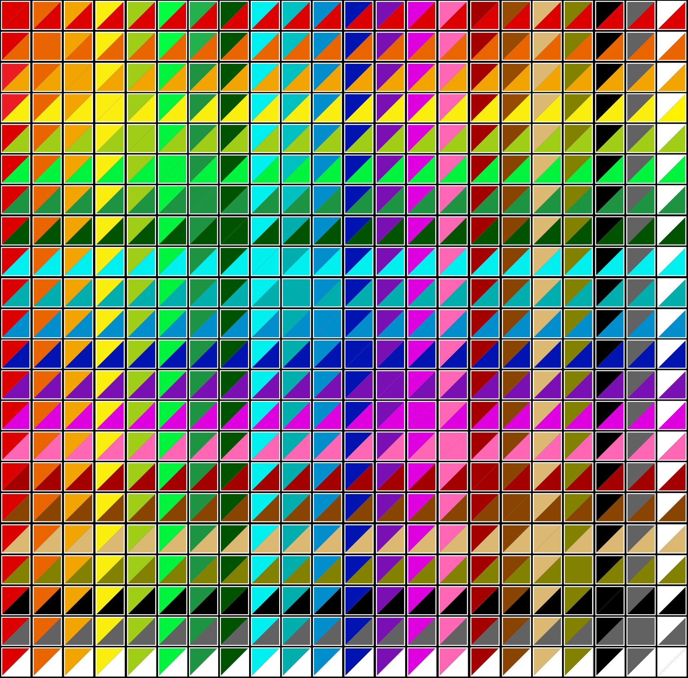

RBGifier
--------

| your image                                    | RGBified                                      |
|-----------------------------------------------|-----------------------------------------------|
|  |  |

### Usage
run 'main.py', providing the path to an image, and (optionally) an output directory \
output will be written into the same directory as the original image by default.

<code>python3 main.py --help </code> \
<code>usage: IMAGE [OUTPUT-DIRECTORY] </code> \
<code>[-h, --help] [--print-only] [--parse-only] </code> \
<code>[--magick {IM,GM}] [--tmpfs] [--noclean] [--nowrite] </code> \
<code>[--relative-img | --relative-cwd | --relative-tmp] </code> \
<code>[--mkdir] [--mkdir-parent] </code> \
<code>[--crop {[W]x[H][%]}[+X][+Y]] </code> \
<code>[--gravity {center,north,south,east,west,northeast,northwest,southeast,southwest}] </code> \
<code>[--scale {int[%]|float[x]}] </code> \
<code>[--scales {int[%]|float[x]} [{int[%]|float[x]} ...]] </code> \
<code>[--edge [RRGGBB[AA]]] [--edge-radius int] </code> \
<code>[--remap {W,B,WB,BW}] [--alpha AA] </code> \
<code>[--white RRGGBB[AA]] [--black RRGGBB[AA]] </code> \
<code>[--fuzz int[%] int[%]] [--threshold int[%] int[%]] </code> \
<code>[--stepsize (float)] [--stepedge (float)] </code> \
<code>[--stepwhite (float)] [--stepblack (float)] </code> \
<code>[--framecap (int)] [--duration (int)] </code> \
<code>[--format fmt [fmt ...]] [--tempformat {MPC,MIFF}] </code>

On startup, the script looks for 'main_config.json' under the 'configs_RGBifier' directory. \
you can set default command-line options and environment values there. \
run 'Config.py' to create/reset config files.
See the [example config](/configs_RGBifier/main_config.example.json) for keys/values

### Prerequisites
requires [ImageMagick](https://github.com/ImageMagick/ImageMagick6) and/or [GraphicsMagick](http://www.GraphicsMagick.org/) (select with '--magick' arg) \
WebP output requires ImageMagick \
MP4 input/output and APNG output require ffmpeg
