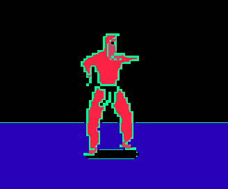

RBGifier
--------

| your image (lame)                             | RGBified!!                                    |
|-----------------------------------------------|-----------------------------------------------|
|  |  |

| your jaguar (ferocious)                    | RGBified!!                                   |
|--------------------------------------------|----------------------------------------------|
|  |  |

| your GIF (boring)                              | RGBified!!                                       |
|------------------------------------------------|--------------------------------------------------|
|  |  |

### Usage
run 'main.py', providing the path to an image, and (optionally) an output directory \
output will be written into the same directory as the original image by default.

<blockquote>
python3 main.py --help
    
    usage: python3 main.py IMAGE [OUTPUT-DIRECTORY]
    [--noclean] [--nowrite] [--print-only] [--parse-only]
    [--magick {IM,GM}] [--tmpfs] [--mkdir] [--mkdir-parent]
    [--relative-img | --relative-cwd | --relative-tmp]
    [--crop {[W]x[H][%]}[+X][+Y]]
    [--gravity {center,north,south,east,west,northeast,northwest,southeast,southwest}]
    [--scale {int[%]|float[x]}] [--scales {int[%]|float[x]} [{int[%]|float[x]} ...]]
    [--remap {W,B,WB,BW}] [--alpha AA] [--white RRGGBB[AA]] [--black RRGGBB[AA]]
    [--edge [RRGGBB[AA]]] [--edge-radius int] [--fuzz int[%] int[%]] [--threshold int[%] int[%]]
    [--stepsize (float)] [--stepedge (float)] [--stepwhite  (float)] [--stepblack (float)]
    [--format fmt [fmt ...]] [--tempformat {MPC,MIFF}]
    [--framecap (int)] [--duration (int)]

</blockquote>

On startup, the script looks for 'main_config.json' under the 'configs_RGBifier' directory. \
you can set default command-line options and environment values there. \
run 'Config.py' to create or reset config files.
See the [example config](/configs_RGBifier/main_config.example.json) for keys/values

### Prerequisites
requires [ImageMagick](https://github.com/ImageMagick/ImageMagick6) and/or [GraphicsMagick](http://www.GraphicsMagick.org/) (select with '--magick' arg) \
WebP output requires ImageMagick \
MP4 input/output and APNG output require ffmpeg
